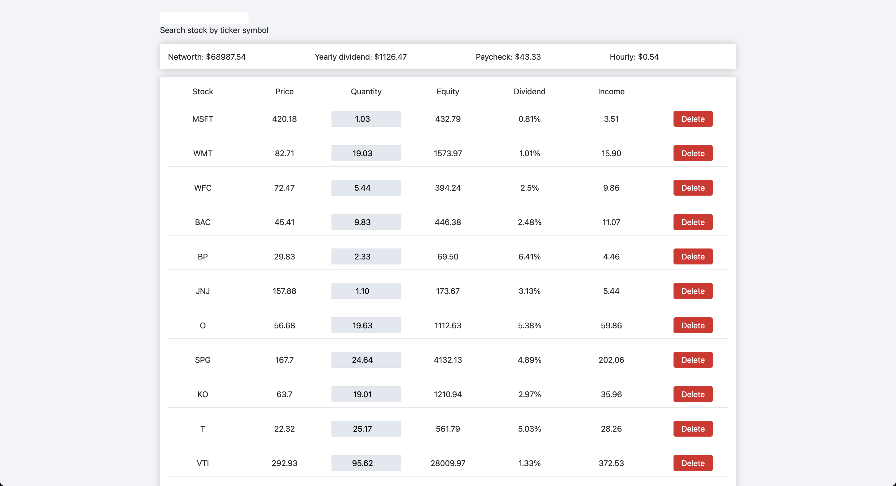

# Dividend Tracker

Developed a stock tracking app that estimates dividend returns, empowering users to budget effectively toward financial freedom.
Implemented web scraping techniques to create an API that retrieves stock prices and dividends for net worth calculations.
Utilized local storage to securely maintain user data, including stock names and quantities, enhancing the overall user experience.

## To-Do List:

- [ ] Move localStorage out and into a Database
- [ ] Implement Log In
- [ ] Create Mobile Layout (Currently only desktop)
- [ ] Move to Next.js
- [ ] Implement TypeScript
- [ ] Get access to brokerage API to pull data automatically 🤔
